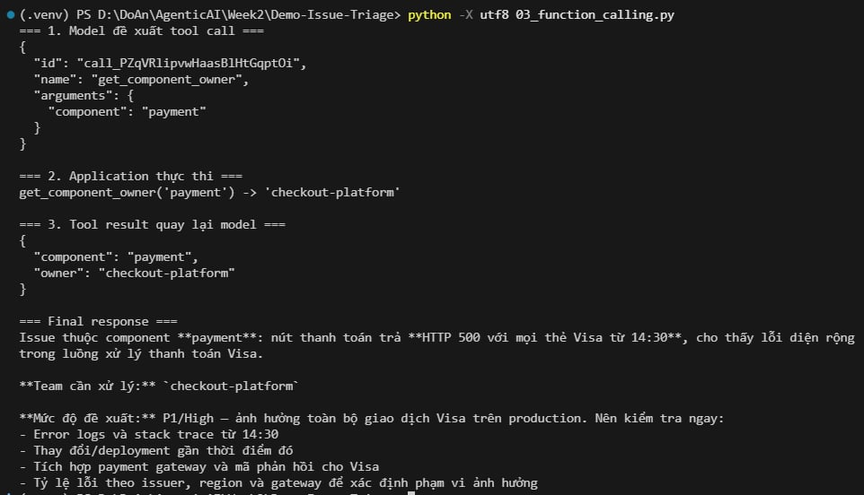
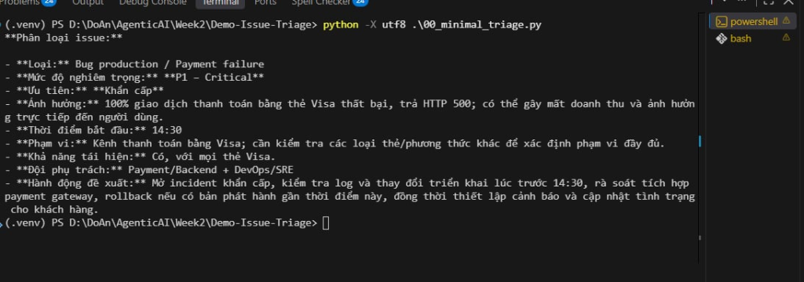
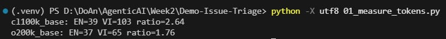
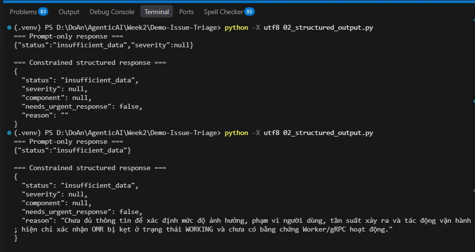

<p align="center">
  <a href="https://www.uit.edu.vn/" title="University of Information Technology" style="border: none;">
    
  </a>
</p>

<h1 align="center"><b>SE373 - Kỹ thuật xây dựng hệ thống Agentic AI</b></h1>
<h3 align="center"><i>(Agentic AI Engineering for Software Systems)</i></h3>

# Course Project: Software Issue Triage with Structured Output & Function Calling

> This repository contains the full implementation and practice report for the **Software Issue Triage System** developed for the course **SE373 – Kỹ thuật xây dựng hệ thống Agentic AI (Agentic AI Engineering for Software Systems)** at the University of Information Technology (UIT – VNU-HCM).  
>  
> The project focuses on building an intelligent issue triage workflow leveraging **Token Measurement**, **Constrained Structured Output**, and **Application-Controlled Function Calling**, with an interactive **Streamlit Web UI** and standalone HTML report generation.
>  
> **Original Practice Guide:** [demo-guide.html](demo-guide.html)  
> **Interactive Web UI Result:** [streamlit-triage-result.html](streamlit-triage-result.html)

<p align="center">
  
</p>

---

## Author Information
|  No. | Student ID | Full Name           | Role               | Github                                     | Email                  |
| ---: | :--------: | ------------------- | ------------------ | ------------------------------------------ | ---------------------- |
|    1 |  23520384  | Pham Tran Khanh Duy | Author / Developer | [PhDuy2005](https://github.com/PhDuy2005/) | 23520384@gm.uit.edu.vn |

---

## Table of Contents
- [Course Project: Software Issue Triage with Structured Output \& Function Calling](#course-project-software-issue-triage-with-structured-output--function-calling)
  - [Author Information](#author-information)
  - [Table of Contents](#table-of-contents)
  - [1. Tổng quan bài thực hành](#1-tổng-quan-bài-thực-hành)
  - [2. Các cải tiến so với phiên bản ban đầu](#2-các-cải-tiến-so-với-phiên-bản-ban-đầu)
    - [Chi tiết các cải tiến mã nguồn:](#chi-tiết-các-cải-tiến-mã-nguồn)
      - [Cải tiến 1: Tối ưu hoá Structured Output \& Đổi mới kịch bản thử nghiệm (`02_structured_output.py`)](#cải-tiến-1-tối-ưu-hoá-structured-output--đổi-mới-kịch-bản-thử-nghiệm-02_structured_outputpy)
      - [Cải tiến 2: Tích hợp tính năng xuất \& tải báo cáo HTML độc lập (`04_streamlit_triage.py`)](#cải-tiến-2-tích-hợp-tính-năng-xuất--tải-báo-cáo-html-độc-lập-04_streamlit_triagepy)
  - [3. Báo cáo kết quả thực hành chi tiết (Kèm minh chứng)](#3-báo-cáo-kết-quả-thực-hành-chi-tiết-kèm-minh-chứng)
    - [3.1. Demo 00: LLM Call Tối Thiểu (`00_minimal_triage.py`)](#31-demo-00-llm-call-tối-thiểu-00_minimal_triagepy)
    - [3.2. Demo 01: Đo Lường Token Tiếng Anh vs Tiếng Việt (`01_measure_tokens.py`)](#32-demo-01-đo-lường-token-tiếng-anh-vs-tiếng-việt-01_measure_tokenspy)
    - [3.3. Demo 02: Structured Output với Schema Ràng Buộc (`02_structured_output.py`)](#33-demo-02-structured-output-với-schema-ràng-buộc-02_structured_outputpy)
    - [3.4. Demo 03: Application-Controlled Function Calling (`03_function_calling.py`)](#34-demo-03-application-controlled-function-calling-03_function_callingpy)
    - [3.5. Demo 04/05: Streamlit Web UI \& Xuất Báo Cáo HTML Độc Lập (`04_streamlit_triage.py`)](#35-demo-0405-streamlit-web-ui--xuất-báo-cáo-html-độc-lập-04_streamlit_triagepy)
  - [4. Hướng dẫn cài đặt và chạy thử nghiệm](#4-hướng-dẫn-cài-đặt-và-chạy-thử-nghiệm)
    - [4.1. Chuẩn bị môi trường](#41-chuẩn-bị-môi-trường)
    - [4.2. Cấu hình biến môi trường (`.env`)](#42-cấu-hình-biến-môi-trường-env)
    - [4.3. Chạy lần lượt các demo](#43-chạy-lần-lượt-các-demo)
  - [5. Kết luận \& Bài học kinh nghiệm](#5-kết-luận--bài-học-kinh-nghiệm)

---

## 1. Tổng quan bài thực hành
- **Môn học:** SE373 — Kỹ thuật xây dựng hệ thống Agentic AI *(Agentic AI Engineering for Software Systems)*  
- **Chủ đề thực hành:** Tuần 02 / Buổi 02 — Software Issue Triage  
- **Mục tiêu:** Làm chủ quy trình xây dựng ứng dụng Agentic AI trong kỹ thuật phần mềm (Software Engineering), cụ thể là bài toán **Issue Triage** (tiếp nhận, phân tích, xác thực và phân loại sự cố cho đúng đội ngũ phụ trách). 

Chuỗi bài tập được thiết kế tuần tự qua 5 cấp độ (từ Demo 00 đến Demo 04/05):
1. **Demo 00 (`00_minimal_triage.py`)**: Gọi LLM cơ bản qua OpenAI-compatible API và nhận kết quả văn tự do (prose output).
2. **Demo 01 (`01_measure_tokens.py`)**: Đo lường và so sánh hiệu quả mã hóa token (tokenizer) giữa tiếng Anh và tiếng Việt qua `tiktoken`.
3. **Demo 02 (`02_structured_output.py`)**: Ép kiểu dữ liệu đầu ra nghiêm ngặt (Constrained Structured Output) theo Pydantic schema, loại bỏ hoàn toàn rủi ro sai định dạng của prompt-only JSON.
4. **Demo 03 (`03_function_calling.py`)**: Mô hình gọi hàm có kiểm soát bởi ứng dụng (Application-Controlled Function Calling): Model đề xuất $\rightarrow$ Ứng dụng xác thực & thực thi $\rightarrow$ Trả kết quả về cho Model.
5. **Demo 04/05 (`04_streamlit_triage.py`)**: Triển khai giao diện Web UI tương tác thời gian thực với Streamlit, trực quan hóa toàn bộ chu trình tool trace và xuất báo cáo kết quả.

---

## 2. Các cải tiến so với phiên bản ban đầu

So với phiên bản mã nguồn khởi tạo ban đầu (trong gói `Demo Issue Triage-20260919.zip`), dự án đã được nghiên cứu, tối ưu và bổ sung nhiều cải tiến kỹ thuật quan trọng nhằm tăng tính thực tiễn, độ ổn định và trải nghiệm người dùng:

| Tiêu chí                                     | Bản khởi tạo ban đầu                                                | Bản cải tiến hoàn thiện                                                                               | Lợi ích đạt được                                                                                                   |
| :------------------------------------------- | :------------------------------------------------------------------ | :---------------------------------------------------------------------------------------------------- | :----------------------------------------------------------------------------------------------------------------- |
| **Bảo mật & Quản trị Repo**                  | Không có `.gitignore`                                               | Bổ sung file [`.gitignore`](.gitignore) chuẩn                                                         | Bảo vệ tuyệt đối API Key trong `.env`, ngăn commit `.venv`, cache và file tạm lên Git.                             |
| **Kịch bản kiểm thử Demo 02**                | Sử dụng mẫu issue cơ bản về thanh toán Visa                         | Cập nhật issue phức tạp thực tế: Lỗi hệ thống phân tán (OMR, Worker, gRPC)                            | Thử thách khả năng đọc hiểu lỗi kỹ thuật sâu và phân tích dữ liệu chưa đầy đủ (`insufficient_data`).               |
| **Độ bền vững Schema (Demo 02)**             | Trường `reason` bắt buộc, không có default value                    | Bổ sung `Field(default="", description=...)` cho trường `reason`                                      | Ngăn chặn `ValidationError` crash ứng dụng nếu model sinh thiếu hoặc để chuỗi rỗng trong trường hợp dữ liệu thiếu. |
| **Khả năng lưu kết quả Web UI (Demo 04/05)** | Không hỗ trợ; Streamlit là SPA React nên lưu trang chỉ ra HTML rỗng | Tích hợp engine sinh HTML báo cáo độc lập ([`generate_html_report`](04_streamlit_triage.py))          | Tạo báo cáo HTML độc lập có CSS đẹp mắt, mở offline không cần server.                                              |
| **Tự động lưu báo cáo**                      | Chưa có                                                             | Tự động ghi đè file [streamlit-triage-result.html](streamlit-triage-result.html) ngay khi triage xong | Người dùng có ngay file kết quả trong thư mục làm việc mà không cần thao tác thủ công.                             |
| **Tải và Sao chép nhanh**                    | Chưa có                                                             | Thêm nút `st.download_button` và khối `st.code` sao chép 1-click                                      | Xuất báo cáo linh hoạt, dễ dàng chia sẻ hoặc đính kèm vào ticket Jira/GitHub.                                      |
| **Minh chứng thực nghiệm**                   | Chưa có                                                             | Lưu trữ đầy đủ ảnh chụp màn hình kết quả từ Demo 01 đến 04                                            | Minh bạch kết quả thực hành, phục vụ đối soát và báo cáo.                                                          |

### Chi tiết các cải tiến mã nguồn:

#### Cải tiến 1: Tối ưu hoá Structured Output & Đổi mới kịch bản thử nghiệm ([`02_structured_output.py`](02_structured_output.py))
- **Nâng cấp Schema:** Cập nhật model `IssueTriage`:
  ```python
  class IssueTriage(BaseModel):
      status: Literal["triaged", "duplicate", "insufficient_data"]
      severity: Literal["P0", "P1", "P2", "P3"] | None = None
      component: str | None = None
      needs_urgent_response: bool = False
      reason: str = Field(default="", description="Lý do ngắn gọn dựa trên dữ liệu issue")
  ```
- **Kịch bản thực tế:** Đưa vào kịch bản lỗi dịch vụ phân tán:
  > *"Tính năng OMR (Optical Mark Recognition) student's answer sheet luôn trả về trạng thái WORKING, không phát hiện Worker đang hoạt động. Chưa có bằng chứng hoạt động của gRPC Communication"*
  
  $\rightarrow$ Giúp kiểm chứng hành vi của model khi thông tin chưa đủ để kết luận component, model chuyển đúng sang trạng thái `insufficient_data` mà vẫn đảm bảo schema hợp lệ.

#### Cải tiến 2: Tích hợp tính năng xuất & tải báo cáo HTML độc lập ([`04_streamlit_triage.py`](04_streamlit_triage.py))
- **Vấn đề của bản gốc:** Do Streamlit là Single Page Application render động qua WebSocket, khi người dùng bấm `Ctrl + S` lưu trang từ trình duyệt thì chỉ nhận được thẻ rỗng `<div id="root"></div>`, không lưu được kết quả thực thi.
- **Giải pháp:** Xây dựng hàm `generate_html_report(issue, result)` sinh mã HTML độc lập:
  - Tích hợp sẵn CSS Responsive, bảng màu chuẩn, card hiển thị metrics component/owner.
  - Định dạng toàn bộ trace function calling (Call ID, Arguments, Application execution result).
  - Định dạng câu trả lời markdown của LLM thành HTML hiển thị trực quan.
  - Tự động lưu thẳng ra đĩa: [streamlit-triage-result.html](streamlit-triage-result.html).
  - Bổ sung nút bấm tải về `st.download_button` và expander chứa mã HTML để copy trực tiếp trên Web UI.

---

## 3. Báo cáo kết quả thực hành chi tiết (Kèm minh chứng)

### 3.1. Demo 00: LLM Call Tối Thiểu (`00_minimal_triage.py`)
- **Mục tiêu:** Kiểm tra kết nối API, cấu hình endpoint (`OPENAI_BASE_URL`), khóa bí mật (`OPENAI_API_KEY`) và tên mô hình (`OPENAI_MODEL`).
- **Nội dung:** Gửi một mô tả sự cố thanh toán và nhận câu trả lời dạng văn bản tự do (unstructured text).
- **Kết quả thực thi:**
  - Mô hình tiếp nhận issue thành công, phân tích và trả về phân loại chi tiết: loại sự cố (Bug production / Payment failure), mức độ nghiêm trọng (P1 - Critical), phạm vi và đội ngũ phụ trách (Payment/Backend + DevOps/SRE).
  
>   
> *Hình 1: Kết quả chạy Demo 00 — Minimal LLM Call (`demo-01-result.png`)*

---

### 3.2. Demo 01: Đo Lường Token Tiếng Anh vs Tiếng Việt (`01_measure_tokens.py`)
- **Mục tiêu:** Đánh giá chi phí token và hiệu suất mã hóa giữa hai thế hệ tokenizer (`cl100k_base` dùng cho GPT-4 và `o200k_base` dùng cho GPT-4o).
- **Kết quả thực thi:**
  - `cl100k_base`: Tiếng Anh = 39 tokens, Tiếng Việt = 103 tokens $\rightarrow$ Tỷ lệ phình to (ratio) = **2.64**.
  - `o200k_base`: Tiếng Anh = 37 tokens, Tiếng Việt = 65 tokens $\rightarrow$ Tỷ lệ phình to (ratio) = **1.76**.
  - **Nhận xét:** Tokenizer thế hệ mới `o200k_base` đã tối ưu hóa từ vựng cho tiếng Việt, giúp giảm số lượng token tiêu thụ tới **~37%** so với `cl100k_base`. Điều này giảm trực tiếp chi phí gọi API và tăng tốc độ phản hồi đáng kể cho các prompt tiếng Việt.

>   
> *Hình 2: Kết quả đo lường và so sánh token (`demo-02-result.png`)*

---

### 3.3. Demo 02: Structured Output với Schema Ràng Buộc (`02_structured_output.py`)
- **Mục tiêu:** So sánh sự khác biệt và độ tin cậy giữa việc chỉ dùng Prompt để yêu cầu JSON (Prompt-only) và việc cưỡng chế cấu trúc bằng schema (Constrained Structured Output).
- **Kịch bản kiểm thử:** Sử dụng issue nâng cao về lỗi dịch vụ nhận dạng bài thi OMR và truyền thông gRPC.
- **Kết quả thực thi:**
  - **Prompt-only response:** `{"status": "insufficient_data"}` $\rightarrow$ Mô hình tự ý cắt bỏ các trường dữ liệu khác (`severity`, `component`, `needs_urgent_response`, `reason`), gây lỗi khi code phía backend cố gắng truy cập các thuộc tính này.
  - **Constrained structured response:** Đảm bảo đầy đủ 100% các trường theo định nghĩa của Pydantic schema `IssueTriage`:
    ```json
    {
      "status": "insufficient_data",
      "severity": null,
      "component": null,
      "needs_urgent_response": false,
      "reason": "Chưa đủ thông tin để xác định mức độ ảnh hưởng, phạm vi người dùng, tần suất xảy ra và tác động vận hành ; hiện chỉ xác nhận OMR bị kẹt ở trạng thái WORKING và chưa có bằng chứng Worker/gRPC hoạt động."
    }
    ```
  - **Nhận xét:** Structured Output là bắt buộc khi tích hợp AI vào pipeline phần mềm doanh nghiệp để đảm bảo tính an toàn kiểu dữ liệu (type safety) và khả năng xử lý tự động.

>   
> *Hình 3: So sánh Prompt-only JSON và Constrained Structured Output (`demo-03-result.png`)*

---

### 3.4. Demo 03: Application-Controlled Function Calling (`03_function_calling.py`)
- **Mục tiêu:** Thực hiện mô hình gọi hàm an toàn trong Agentic AI: Mô hình chỉ **đề xuất** công cụ cần gọi, ứng dụng đứng giữa **kiểm tra tính hợp lệ và quyền hạn** trước khi thực thi, rồi gửi kết quả trở lại cho mô hình.
- **Kết quả thực thi:**
  1. **Model đề xuất tool call:** Mô hình nhận diện sự cố liên quan đến thẻ Visa và phát sinh yêu cầu gọi `get_component_owner(component='payment')` với `call_id` cụ thể (`call_PZqVRlipvwHaasBlHtGqptOi`).
  2. **Application thực thi:** Ứng dụng kiểm tra component `'payment'` nằm trong whitelist hợp lệ (`payment`, `identity`, `search`), thực thi hàm nội bộ và xác định owner là `'checkout-platform'`.
  3. **Tool result quay lại model:** Trả payload JSON `{"component": "payment", "owner": "checkout-platform"}` cho model.
  4. **Final response:** Mô hình tổng hợp đầy đủ thông tin: xác định rõ đội phụ trách là `checkout-platform`, đánh giá mức độ P1/High và đề xuất các bước khắc phục sự cố tức thời.

>   
> *Hình 4: Chu trình Function Calling có kiểm soát bởi Application (`demo-04-result.png`)*

---

### 3.5. Demo 04/05: Streamlit Web UI & Xuất Báo Cáo HTML Độc Lập (`04_streamlit_triage.py`)
- **Mục tiêu:** Xây dựng bảng điều khiển trực quan cho kỹ sư vận hành hệ thống, theo dõi trực tiếp các bước suy luận và tool trace của Agent, đồng thời cung cấp tính năng lưu trữ kết quả.
- **Kết quả đạt được:**
  - Giao diện trực quan chia thành 2 phần: Thông số runtime ở sidebar và form nhập liệu ở vùng chính.
  - Hiển thị trực quan 2 thẻ chỉ số quan trọng: **Component đã xác thực** (`payment`) và **Team phụ trách** (`checkout-platform`).
  - Hộp mở rộng (Expander) hiển thị chi tiết vết gọi hàm (Tool Traces) bao gồm Call ID, Arguments và kết quả trả về của hệ thống.
  - Tích hợp tính năng cải tiến: Tự động kết xuất toàn bộ phiên làm việc thành file HTML độc lập [streamlit-triage-result.html](streamlit-triage-result.html) và nút download trực tiếp trên UI.

> [!TIP]
> Bạn có thể mở trực tiếp file [streamlit-triage-result.html](streamlit-triage-result.html) trên bất kỳ trình duyệt web nào (Chrome, Edge, Firefox) để xem lại giao diện kết quả hoàn chỉnh mà không cần khởi chạy máy chủ Streamlit.

---

## 4. Hướng dẫn cài đặt và chạy thử nghiệm

### 4.1. Chuẩn bị môi trường
```powershell
# Di chuyển vào thư mục dự án
cd Week2/Demo-Issue-Triage

# Kích hoạt môi trường ảo Python đã cài sẵn
.\.venv\Scripts\Activate.ps1

# (Nếu tạo mới môi trường ảo)
# python -m venv .venv
# .\.venv\Scripts\Activate.ps1
# pip install -r requirements.txt
```

### 4.2. Cấu hình biến môi trường (`.env`)
Tạo file `.env` từ `.env.example` và thiết lập các thông số:
```env
OPENAI_API_KEY=your_api_key_here
OPENAI_BASE_URL=https://your-openai-compatible-provider/v1
OPENAI_MODEL=your-model-name
```

### 4.3. Chạy lần lượt các demo
```powershell
# Demo 00: Minimal LLM Call
python -X utf8 .\00_minimal_triage.py

# Demo 01: Đo lường Token
python -X utf8 .\01_measure_tokens.py

# Demo 02: Structured Output
python -X utf8 .\02_structured_output.py

# Demo 03: Function Calling
python -X utf8 .\03_function_calling.py

# Demo 04/05: Streamlit Web UI
streamlit run 04_streamlit_triage.py --server.headless true
```

---

## 5. Kết luận & Bài học kinh nghiệm

Qua chuỗi thực hành toàn diện về Issue Triage, các bài học quan trọng rút ra bao gồm:
1. **Kiểm soát tính ngẫu nhiên của LLM:** Trong các hệ thống sản phẩm (production), không bao giờ phụ thuộc vào văn bản tự do hoặc prompt-only JSON. Việc sử dụng **Structured Output** và **Pydantic Validation** là điều kiện tiên quyết để đảm bảo tính ổn định của hệ thống.
2. **Nguyên tắc "Human/Application in the loop" trong Function Calling:** Mô hình ngôn ngữ chỉ đóng vai trò "bộ não lập luận" (Planner/Decider), còn quyền thực thi các hành động nhạy cảm (truy vấn DB, gọi API, thao tác hạ tầng) bắt buộc phải do **Application code kiểm soát và phê duyệt**.
3. **Tối ưu chi phí và ngôn ngữ:** Việc nắm rõ cách thức tokenizer mã hóa (như sự cải tiến giữa `cl100k_base` và `o200k_base`) giúp các kỹ sư ước lượng chính xác chi phí vận hành và tối ưu hóa câu lệnh đối với dữ liệu tiếng Việt.
4. **Trải nghiệm hoàn chỉnh từ Backend đến Frontend:** Kết hợp giữa pipeline suy luận logic phía sau và giao diện trực quan (Streamlit) kèm khả năng lưu trữ, kết xuất báo cáo tĩnh (Standalone HTML) tạo nên một giải pháp hoàn chỉnh, sẵn sàng ứng dụng trong thực tế doanh nghiệp.
