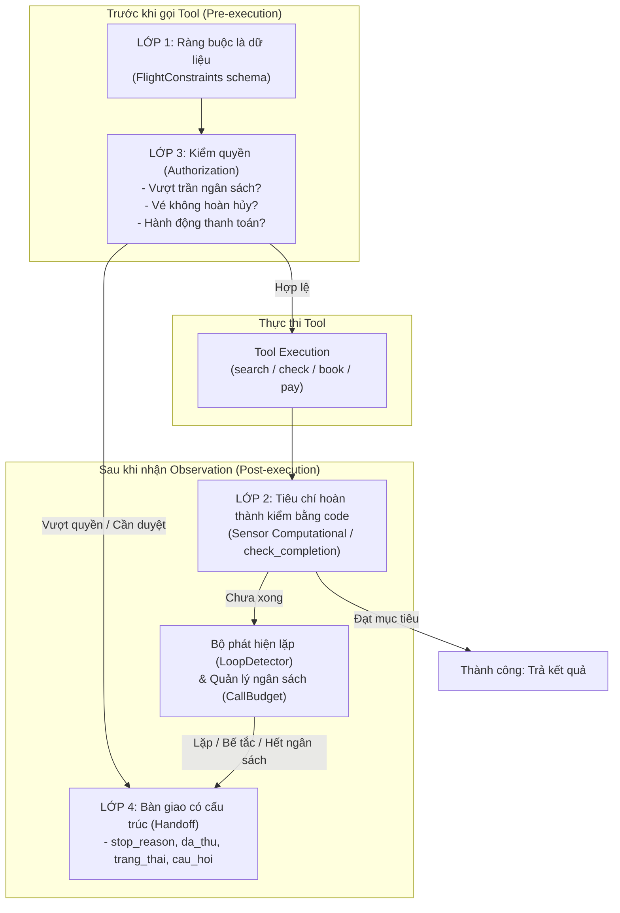
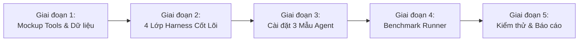

# BẢN KẾ HOẠCH KỸ THUẬT TOÀN DIỆN (MASTER IMPLEMENTATION PLAN)
## BTVN#3 · Dựng Agent Đặt Vé Máy Bay bằng LangChain & LangGraph

> **Căn cứ tài liệu bài học & thực hành:**
> - **Giáo trình:** [SE373_Agent_Fundamentals_Week3.md](file:///d:/DoAn/AgenticAI/Week3/SE373_Agent_Fundamentals_Week3.md) (Slide 1–70 Buổi 03: Vòng lặp Agent, ReAct & các mẫu suy luận, Điều kiện dừng, Debugging & 4 failure modes).
> - **Mã nguồn minh họa:** Thư mục [Week-3/demo2-sv/demo2-sv](file:///d:/DoAn/AgenticAI/Week3/Week-3/demo2-sv/demo2-sv) (gồm `demo2_dieu_kien_dung.py`, `lib/harness.py`, `lib/model_gia.py`, `lib/tools_dulich.py`).
> - **Yêu cầu bài tập:** [Week3-requirment.md](file:///d:/DoAn/AgenticAI/Week3/Week3-requirment.md).

---

## 1. TỔNG QUAN NHIỆM VỤ & BỐI CẢNH HỌC PHẦN

### 1.1. Mục tiêu bài toán
Xây dựng một hệ thống **AI Agent hỗ trợ tìm kiếm và đặt vé máy bay** có khả năng tự chủ hoạt động, xử lý nghiệp vụ hàng không thực tế thông qua các công cụ mô phỏng (Mockup Tools), được bao bọc bởi **bộ Harness 4 lớp an toàn** và triển khai so sánh trên **3 mẫu thiết kế suy luận** khác nhau.

### 1.2. Đối chiếu chuẩn mực giáo trình SE373 (Buổi 03)
Theo giáo trình buổi 3:
1. **Định nghĩa Agent:** $\text{Agent} = \text{Goal} + \text{Tools} + \text{Loop} + \text{Termination}$. Trong đó Model chỉ quyết định bước đi tiếp theo lúc chạy; toàn bộ các bước dựng ngữ cảnh, kiểm quyền, gọi tool, ghi nhận observation và xét điều kiện dừng thuộc về **Harness** (code do kỹ sư viết).
2. **Ranh giới Model và Harness:** Không tin tưởng phán đoán chủ quan của Model khi nó tuyên bố "đã xong". Mọi tiêu chí hoàn thành phải được kiểm chứng bằng logic code khách quan (Sensor Computational).
3. **5 Điều kiện dừng:**
   - Đạt mục tiêu (Tiêu chí hoàn thành bằng code thoả mãn).
   - Hết ngân sách (Trần số bước, token, chi phí).
   - Phát hiện lặp (`(tool, args)` trùng lặp).
   - Bế tắc (Đổi tool liên tục nhưng đại lượng tiến triển đứng yên).
   - Cần con người phê duyệt (Kiểm quyền phát hiện hành động vượt thẩm quyền).
4. **4 Failure Modes của Agent:**
   - Lặp không tiến bộ (khắc phục bằng mã lỗi gợi ý và `LoopDetector`).
   - Bịa đặt thông tin (Hallucination - khắc phục bằng đối chiếu chéo căn cứ dữ liệu).
   - Quên yêu cầu ban đầu (khắc phục bằng **Ràng buộc là dữ liệu**).
   - Tin vào dữ liệu sai (khắc phục bằng chuẩn hóa **Structured JSON Observation**).

---

## 2. THIẾT KẾ DỮ LIỆU & MOCKUP TOOLS NGHIỆP VỤ HÀNG KHÔNG

### 2.1. Dữ liệu chuyến bay giả lập (`FLIGHT_DATABASE`)
Để đảm bảo các kịch bản kiểm thử có tính lặp lại (reproducible), dữ liệu chuyến bay được thiết kế tĩnh nhưng đa dạng các tình huống nghiệp vụ:

```python
# Cấu trúc dữ liệu chuyến bay
FLIGHT_DATABASE = [
    {
        "flight_no": "VN122",
        "airline": "Vietnam Airlines",
        "origin": "SGN",
        "destination": "DAD",
        "depart_date": "2026-10-07",
        "depart_time": "08:30",
        "arrive_time": "10:00",
        "base_price": 1_850_000,
        "available_seats": 5,
        "seat_class": "Economy",
        "refundable": True,
        "note": "Chuyến sáng đúng yêu cầu, giá trong ngân sách, được hoàn hủy."
    },
    {
        "flight_no": "VJ602",
        "airline": "Vietjet Air",
        "origin": "SGN",
        "destination": "DAD",
        "depart_date": "2026-10-07",
        "depart_time": "06:15",
        "arrive_time": "07:35",
        "base_price": 1_350_000,
        "available_seats": 0,  # HẾT CHỖ - Dùng để test biến động môi trường / replanning
        "seat_class": "Eco",
        "refundable": False,
        "note": "Giá rất rẻ nhưng hết chỗ; agent phải biết đổi chuyến khác."
    },
    {
        "flight_no": "QH118",
        "airline": "Bamboo Airways",
        "origin": "SGN",
        "destination": "DAD",
        "depart_date": "2026-10-07",
        "depart_time": "11:00",
        "arrive_time": "12:20",
        "base_price": 2_350_000,
        "available_seats": 3,
        "seat_class": "Economy Flex",
        "refundable": False,  # VƯỢT HẠN MỨC & KHÔNG HOÀN HỦY - Dùng để test Kiểm quyền
        "note": "Vượt ngân sách 2.000.000đ và không hoàn tiền, cần con người duyệt."
    },
    {
        "flight_no": "VN124",
        "airline": "Vietnam Airlines",
        "origin": "SGN",
        "destination": "DAD",
        "depart_date": "2026-10-07",
        "depart_time": "09:45",
        "arrive_time": "11:15",
        "base_price": 1_920_000,
        "available_seats": 2,
        "seat_class": "Economy Classic",
        "refundable": True,
        "note": "Chuyến thay thế hợp lệ khi VJ602 hết chỗ."
    }
]
```

### 2.2. Danh sách 5 Mockup Tools chuẩn LangChain

Mọi tool đều tuân thủ nguyên tắc ở Slide 13 & 65: **Observation là giao diện điều khiển của Agent**, luôn trả kết quả có cấu trúc JSON, kèm mã trạng thái và gợi ý (`hint`) rõ ràng khi thất bại:

| Tên Tool         | Tham số đầu vào                                       | Kết quả trả về (Observation)                                                                                          | Ý nghĩa nghiệp vụ & Chặn lỗi                                                                                           |
| ---------------- | ----------------------------------------------------- | --------------------------------------------------------------------------------------------------------------------- | ---------------------------------------------------------------------------------------------------------------------- |
| `search_flights` | `origin: str, destination: str, date: str`            | `{"status": "ok", "matched": int, "flights": [...]}`                                                                  | Tìm danh sách chuyến bay khớp chặng và ngày. Nếu không tìm thấy, trả gợi ý các tuyến bay hiện hỗ trợ.                  |
| `check_seat`     | `flight_no: str`                                      | `{"status": "ok", "flight_no": str, "available_seats": int, "price": int, "refundable": bool}`                        | Kiểm tra ghế thực tế và chính sách hoàn hủy. Nếu mã chuyến sai, trả mã lỗi `flight_not_found` kèm danh sách mã hợp lệ. |
| `book_seat`      | `flight_no: str, passenger_name: str, seat_code: str` | `{"status": "ok", "booking_code": "VN-4XJ2", "state": "held", "price": int, "expires_in": "15m"}`                     | Giữ chỗ tạm thời. Trạng thái là `held`, chưa thanh toán. Trả lỗi nếu chuyến bay hết chỗ.                               |
| `pay`            | `booking_code: str, payment_method: str`              | `{"status": "ok", "booking_code": str, "state": "confirmed", "paid": True, "amount": int}`                            | Thực hiện thanh toán cho mã giữ chỗ, đổi trạng thái sang `confirmed`.                                                  |
| `get_booking`    | `booking_code: str`                                   | `{"status": "ok", "booking": {"booking_code": str, "flight_no": str, "state": str, "paid": bool, "price": int, ...}}` | Tra cứu chi tiết booking. Dùng cho Sensor Computational kiểm chứng chéo độc lập với LLM.                               |

---

## 3. THIẾT KẾ CHI TIẾT 4 LỚP HARNESS

Theo Slide 10–15, 34–49, và 62 của giáo trình, 4 lớp harness này tạo thành lá chắn bảo vệ toàn diện cho chu trình hoạt động của Agent.



---

### 3.1. Lớp 1: Ràng buộc là dữ liệu (Constraints as Data)
- **Vấn đề ngăn chặn (Slide 60–62):** Tránh lỗi "Quên yêu cầu ban đầu" khi ngữ cảnh dài ra qua nhiều vòng lặp. Agent dễ bị xao nhãng (ví dụ: chuyển sang tìm chuyến bay ngày khác hoặc xem đánh giá hãng).
- **Thiết kế kỹ thuật:**
  - Không truyền yêu cầu dưới dạng câu văn tự do trong chat history mà gói thành cấu trúc dữ liệu tường minh:
  ```python
  from dataclasses import dataclass

  @dataclass(frozen=True)
  class FlightConstraints:
      origin: str                 # "SGN"
      destination: str            # "DAD"
      depart_date: str            # "2026-10-07"
      max_price: int              # 2_000_000 (VNĐ)
      time_preference: str = "sang" # "sang" (< 12:00)
      require_refundable: bool = True
  ```
  - Harness lưu cấu trúc này ở vị trí cố định trong State của Agent.
  - Trước khi model đưa ra câu trả lời cuối cùng, hàm `validate_constraints(booking_info, constraints)` được kích hoạt để đối chiếu từng trường: ngày bay, giờ bay, giá vé, chính sách hoàn hủy.

---

### 3.2. Lớp 2: Tiêu chí hoàn thành kiểm bằng code (Sensor Computational)
- **Vấn đề ngăn chặn (Slide 43–44):** Tuyệt đối không để Model tự xưng là "tôi đã đặt vé xong". Model có thể sinh câu trả lời thành công giả (hallucination) trong khi chưa từng gọi tool `pay` hoặc vé chưa ở trạng thái `confirmed`.
- **Thiết kế kỹ thuật:**
  - Dùng **Sensor Computational** (hàm Python xác định, chạy trong vài mili-giây, không tốn token):
  ```python
  def check_completion(booking_code: str, constraints: FlightConstraints, tool_history: list) -> dict:
      if not booking_code:
          return {"completed": False, "reason": "Chưa có mã đặt chỗ"}
      
      # 1. Gọi trực tiếp API get_booking để kiểm tra trạng thái thực tế
      booking = get_booking_direct(booking_code)
      if not booking:
          return {"completed": False, "reason": f"Mã booking {booking_code} không tồn tại"}
      
      # 2. Kiểm tra các vị từ logic cốt lõi
      is_confirmed = booking.get("state") == "confirmed"
      is_paid = booking.get("paid") is True
      price_ok = booking.get("price", float("inf")) <= constraints.max_price
      date_ok = booking.get("depart_date") == constraints.depart_date
      
      # 3. Kiểm chứng chéo (Cross-verification):
      # Giá trong booking phải khớp với giá từng thấy trong kết quả check_seat trước đó
      verified_price = False
      for obs in tool_history:
          if obs.get("tool") == "check_seat" and obs.get("flight_no") == booking.get("flight_no"):
              if obs.get("price") == booking.get("price"):
                  verified_price = True
                  break
      
      completed = is_confirmed and is_paid and price_ok and date_ok and verified_price
      return {
          "completed": completed,
          "checks": {
              "status_confirmed": is_confirmed,
              "paid": is_paid,
              "within_budget": price_ok,
              "date_matched": date_ok,
              "cross_verified_price": verified_price
          }
      }
  ```

---

### 3.3. Lớp 3: Kiểm quyền (Pre-execution Authorization)
- **Vấn đề ngăn chặn (Slide 35, 41, 792–798):** Điều kiện dừng số 5: Chạm tới hành động vượt thẩm quyền hoặc có tác dụng phụ tài chính không đảo ngược được.
- **Vị trí chạy:** Chạy **TRƯỚC KHI THỰC THI TOOL** (Pre-execution Hook).
- **Các ngưỡng thẩm quyền (Authorization Thresholds):**
  1. **Hạn mức tài chính:** Giá vé > 1.800.000đ hoặc vượt `max_price` trong ràng buộc.
  2. **Rủi ro chính sách:** Vé thuộc loại không hoàn hủy (`refundable == False`).
  3. **Hành động cam kết tài chính:** Gọi tool `pay(booking_code, ...)` trừ tiền thật.
- **Cơ chế xử lý khi vi phạm:**
  - Ngắt chuỗi thực thi ngay trước khi gọi hàm.
  - Sinh thông báo Human Approval Request với đầy đủ **3 thành tố theo Slide 41**:
    1. **Đang ở đâu:** "Đã tìm thấy chuyến QH118 từ SGN đi DAD lúc 11:00 ngày 07/10."
    2. **Định làm gì:** "Định thực hiện giữ chỗ và thanh toán vé chuyến QH118 với giá 2.350.000đ."
    3. **Vì sao phải hỏi:** "Giá vé 2.350.000đ vượt hạn mức ngân sách 2.000.000đ và đây là loại vé KHÔNG HOÀN HỦY."
  - Chuyển quyền quyết định sang con người (duyệt tiếp tục hoặc hủy bỏ).

---

### 3.4. Lớp 4: Bàn giao có cấu trúc (Structured Handoff)
- **Vấn đề ngăn chặn (Slide 48, demo2 `harness.py`):** Dừng bất thường mà im lặng (silent failure/crash) sẽ biến lỗi thấy được thành lỗi ẩn, làm mất hoàn toàn dấu vết chẩn đoán.
- **Nguyên tắc vàng:** Bàn giao tốt là bàn giao mà người nhận đọc hiểu và đưa ra quyết định xử lý được trong **dưới 30 giây**.
- **Cấu trúc 4 trường bắt buộc:**
  ```python
  def ban_giao(stop_reason: str, da_thu: list, trang_thai: dict, cau_hoi_cho_nguoi: str) -> dict:
      return {
          "stop_reason": stop_reason,        # Lý do dừng (LOOP, STALL, BUDGET, NEED_APPROVAL, ERROR)
          "da_thu": da_thu,                  # Chuỗi hành động đã thử: search -> check_seat -> ...
          "trang_thai": trang_thai,          # Snapshot: số lần gọi tool, chuyến bay đã chọn, chi phí
          "cau_hoi_cho_nguoi": cau_hoi_cho_nguoi  # Câu hỏi cụ thể kèm gợi ý giải pháp
      }
  ```

### 3.5. Cơ chế bổ trợ: LoopDetector & Budget Manager
- **LoopDetector (Slide 45–46):**
  - Tín hiệu 1: Trùng action `(tool, sorted_args)` xuất hiện lần thứ 2 trong cửa sổ 6 vòng gần nhất $\rightarrow$ Báo động `LOOP`.
  - Tín hiệu 2: Trùng observation (gọi khác tham số nhưng kết quả giống hệt quá 3 lần).
  - Tín hiệu 3: Đại lượng tiến triển (số tiêu chí thoả mãn) đứng yên qua $N=3$ vòng $\rightarrow$ Báo động `STALL` (bế tắc).
- **Budget Manager (Slide 15, 38):**
  - Trần số bước lặp: $N_{max} = 10$ lượt gọi model. Chạm trần $\rightarrow$ ngắt với `stop_reason = BUDGET_EXCEEDED` và bàn giao.

---

## 4. CÀI ĐẶT 3 MẪU THIẾT KẾ SUY LUẬN (THREE REASONING PATTERNS)

Yêu cầu 2 của BTVN#3 đòi hỏi cài đặt Agent trên 3 mẫu thiết kế khác nhau. Dưới đây là phân tích kiến trúc, luồng hoạt động và sự đánh đổi của từng mẫu:

```
+---------------------------------------------------------------------------------------+
|                                    BẢNG SO SÁNH 3 MẪU SUY LUẬN                       |
+----------------------+-----------------------------+----------------------------------+
| Mẫu Thiết Kế        | Điểm Mạnh Chính             | Rủi Ro / Điểm Yếu Chính         |
+----------------------+-----------------------------+----------------------------------+
| 1. ReAct             | Rất linh hoạt, thích ứng    | Dễ trôi dạt mục tiêu, dễ lặp     |
|                      | tức thì với dữ liệu mới      | vô hạn nếu thiếu LoopDetector    |
+----------------------+-----------------------------+----------------------------------+
| 2. Plan-then-Execute | Kế hoạch rõ ràng, duyệt     | Kém linh hoạt khi môi trường     |
|                      | trước được, tiết kiệm token | thay đổi; bước 1 sai làm hỏng hết|
+----------------------+-----------------------------+----------------------------------+
| 3. Mẫu Lai (Hybrid)  | Vừa có định hướng dài hạn,  | Cấu trúc phức tạp hơn, cần logic |
|                      | vừa linh hoạt điều chỉnh    | replanner kiểm soát điều kiện    |
+----------------------+-----------------------------+----------------------------------+
```

---

### 4.1. Mẫu 1: ReAct (Reasoning + Acting)
- **Tư tưởng cốt lõi (Slide 18–20):**
  $$\text{Thought} \longrightarrow \text{Action} \longrightarrow \text{Observation} \longrightarrow \text{Thought} \longrightarrow \dots$$
  Mỗi bước suy luận được nuôi dưỡng bởi kết quả thực tế từ môi trường thay vì chỉ dựa vào trí nhớ tĩnh của mô hình.
- **Luồng cài đặt trong bài đặt vé:**
  1. Nhận yêu cầu và ràng buộc dữ liệu.
  2. Model sinh Thought: "Cần tìm chuyến bay từ SGN đến DAD ngày 07/10."
  3. Model sinh Action: `search_flights(origin='SGN', destination='DAD', date='2026-10-07')`.
  4. Harness kiểm quyền $\rightarrow$ Thực thi $\rightarrow$ Trả về Observation gồm 4 chuyến bay.
  5. Model đọc Observation $\rightarrow$ Sinh Thought tiếp theo: "Chuyến VJ602 giá 1.350.000đ rẻ nhất, kiểm tra ghế." $\rightarrow$ Gọi `check_seat('VJ602')`.
  6. Observation báo `available_seats: 0` $\rightarrow$ Model lập tức thích ứng: "VJ602 hết chỗ, chuyển sang kiểm tra VN122 giá 1.850.000đ."
  7. Lặp lại cho đến khi `check_completion` đạt hoặc chạm điều kiện dừng.

---

### 4.2. Mẫu 2: Plan-then-Execute (Lập kế hoạch rồi thực thi)
- **Tư tưởng cốt lõi (Slide 22–23):** Gọi Model 1 lần để sinh trọn vẹn bản kế hoạch gồm danh sách các bước cụ thể, người/harness duyệt qua bản kế hoạch, sau đó thực thi tuần tự từng bước mà không cần gọi lại planner.
- **Luồng cài đặt trong bài đặt vé:**
  - **Pha 1 (Planner):** Dựa trên `FlightConstraints`, sinh kế hoạch 4 bước cố định:
    - *Bước 1:* Tìm chuyến bay SGN $\rightarrow$ DAD ngày 07/10.
    - *Bước 2:* Kiểm tra ghế chuyến VJ602 (do model giả định đây là chuyến rẻ nhất).
    - *Bước 3:* Giữ chỗ chuyến VJ602 ghế 12A cho hành khách.
    - *Bước 4:* Thanh toán mã giữ chỗ và kiểm tra trạng thái vé.
  - **Pha 2 (Executor):** Thực thi máy móc tuần tự từ Bước 1 đến Bước 4.
  - **Hành vi khi có sự cố (The Fragility Problem):**
    - Tại Bước 2, `check_seat('VJ602')` trả về 0 ghế trống.
    - Do kế hoạch đã được "đóng băng", Bước 3 (`book_seat('VJ602', ...)`) vẫn được gọi theo kế hoạch $\rightarrow$ Bị lỗi `flight_full`. Toàn bộ chuỗi phía sau thất bại vì không có cơ chế điều chỉnh linh hoạt.

---

### 4.3. Mẫu 3: Mẫu Lai (Hybrid: Plan + ReAct + Replanning)
- **Tư tưởng cốt lõi (Slide 24):** Kết hợp ưu điểm định hướng của Plan và tính thích nghi của ReAct: Lập kế hoạch tổng thể ban đầu $\rightarrow$ Thực thi từng chặng ngắn với ReAct $\rightarrow$ Khi phát hiện **Observation thay đổi đáng kể** (chuyến bay hết chỗ, giá tăng vượt ngân sách, tool lỗi) $\rightarrow$ Kích hoạt bộ **Replanner** để lập lại kế hoạch cho các chặng tiếp theo dựa trên dữ liệu mới.
- **Luồng cài đặt trong bài đặt vé:**
  1. **Initial Planner:** Sinh kế hoạch khung ban đầu.
  2. **Chặng 1 (Khám phá):** Thực thi tìm kiếm và kiểm tra ghế chuyến bay tối ưu.
  3. **Observation Check:** Khi kiểm tra chuyến VJ602 thấy `available_seats == 0`:
     - Tín hiệu kích hoạt Replanner: *"Observation mâu thuẫn với giả định ban đầu của kế hoạch!"*
  4. **Replanner Node:** Nhận trạng thái hiện tại (VJ602 hết chỗ, còn lại VN122 và QH118), sinh kế hoạch điều chỉnh mới:
     - *Kế hoạch mới Bước 2b:* Kiểm tra ghế chuyến VN122 (1.850.000đ).
     - *Kế hoạch mới Bước 3b:* Giữ chỗ VN122.
     - *Kế hoạch mới Bước 4b:* Thanh toán VN122.
  5. Tiếp tục thực thi đến khi hoàn tất và kiểm chứng thành công bằng code.

---

## 5. THIẾT KẾ BỘ MÔ HÌNH: MODEL GIẢ LẬP & MODEL THẬT

Theo phản hồi lựa chọn của người dùng: **Ưu tiên Model Giả lập deterministic (không tốn tiền API, chấm điểm chuẩn xác) + hỗ trợ tùy chọn Model Thật qua `.env`**.

### 5.1. Model Giả lập (`MockBookingModel`)
- Triển khai kế thừa `BaseChatModel` của LangChain (tương tự như `ModelGia` trong demo của giảng viên).
- Cung cấp 3 chế độ kịch bản khớp với 3 mẫu thiết kế:
  - `kich_ban="react"`: Sinh `tool_calls` phản ứng từng vòng, có logic đọc observation để chọn bước tiếp theo.
  - `kich_ban="plan_execute"`: Sinh kế hoạch tĩnh ban đầu, sau đó sinh lần lượt các tool calls theo đúng kế hoạch đó bất chấp observation.
  - `kich_ban="hybrid"`: Sinh kế hoạch ban đầu, khi phát hiện kết quả trả về `available_seats: 0`, tự động sinh message Replanning điều chỉnh tool call sang chuyến bay thay thế.
- **Lợi ích:** Chạy trong 0.2 giây, hoàn toàn miễn phí, độc lập môi trường mạng, đảm bảo 100% tái hiện được bài giảng khi chấm điểm.

### 5.2. Model Thật (`ModelThat`)
- Tích hợp qua `langchain.chat_models.init_chat_model` hoặc thư viện chuẩn:
  - OpenAI: `gpt-4o-mini`, `gpt-3.5-turbo`
  - Google: `gemini-1.5-flash`, `gemini-2.0-flash`
  - Groq / DeepSeek: API tương thích OpenAI
- Được kích hoạt dễ dàng khi truyền cờ `--model-that` và có file cấu hình `.env`.

---

## 6. THIẾT KẾ BỘ BENCHMARK & KỊCH BẢN ĐÁNH GIÁ (EVALUATION SUITE)

Yêu cầu 3 của BTVN#3: **Đánh giá hiệu quả của Agent với 3 mẫu thiết kế khác nhau**.
Để có đánh giá khách quan, định lượng và khoa học, hệ thống thiết kế **4 kịch bản kiểm thử độc lập**:

### 6.1. Bốn kịch bản kiểm thử thực tế

#### Kịch bản 1: Luồng thuận lợi (Happy Path)
- **Tình huống:** Người dùng yêu cầu tìm và đặt vé SGN $\rightarrow$ DAD ngày 07/10/2026, ngân sách dưới 2.000.000đ.
- **Thực tế dữ liệu:** Chuyến bay VN122 có sẵn ghế, giá 1.850.000đ, đúng khung giờ sáng.
- **Kỳ vọng:** Cả 3 mẫu thiết kế đều hoàn thành xuất sắc. Đánh giá số bước, lượng token tiêu thụ và thời gian chạy.

#### Kịch bản 2: Biến động môi trường (Seat Unavailable / Volatility)
- **Tình huống:** Chuyến bay giá rẻ nhất VJ602 (1.350.000đ) bị hết chỗ (`available_seats = 0`). Chuyến VN124 (1.920.000đ) là phương án thay thế khả thi.
- **Kỳ vọng:**
  - *Plan-then-Execute:* Thất bại do cố chấp làm theo kế hoạch đã lập sẵn cho VJ602.
  - *ReAct:* Thành công nhờ lập tức nhận ra VJ602 hết chỗ và thử chuyển sang chuyến khác.
  - *Mẫu Lai:* Thành công ấn tượng nhờ Replanner ghi nhận sự cố, cập nhật lại lộ trình và thực thi chuẩn xác.

#### Kịch bản 3: Thử thách Kiểm Quyền & Hạn mức (Authorization & Threshold)
- **Tình huống:** Chuyến bay duy nhất còn chỗ trong khung giờ yêu cầu là QH118 với giá 2.350.000đ (vượt trần 2.000.000đ) và vé KHÔNG HOÀN HỦY.
- **Kỳ vọng:** Cả 3 Agent đều phải bị lớp **Kiểm quyền** chặn đứng trước khi thực hiện giữ chỗ hoặc thanh toán tiền thật. Hệ thống phải kích hoạt trạng thái Human Approval Request với đầy đủ 3 thành tố: Đang ở đâu? Định làm gì? Vì sao phải hỏi?

#### Kịch bản 4: Vòng lặp & Tuyến bay không hỗ trợ (Loop & Stall Detection)
- **Tình huống:** Người dùng yêu cầu đặt vé đi "Vũng Tàu" (địa phương không có sân bay thương mại) hoặc tool liên tục trả về thông báo lỗi.
- **Kỳ vọng:** Nếu không có harness, agent sẽ lặp vô hạn các biến thể tên gọi. Với lớp Harness, bộ `LoopDetector` phải phát hiện cặp `(tool, args)` trùng lặp tại Vòng 4 và ngắt luồng an toàn, xuất ra báo cáo **Bàn giao** đầy đủ 4 trường thông tin.

---

### 6.2. Bảng chỉ số đánh giá (Evaluation Metrics)
1. **Tỷ lệ thành công (Success Rate %):** Tỷ lệ kịch bản hoàn thành đúng mục tiêu được xác nhận bởi `check_completion == True`.
2. **Số bước lặp / Số lần gọi Model (Average Steps / Model Calls):** Thước đo mức độ tối ưu hóa chu trình suy luận.
3. **Thời gian thực thi (Latency in seconds/ms):** Tốc độ phản hồi tổng thể của Agent.
4. **Ước tính chi phí / Token tiêu thụ (Token Efficiency):** Số lượng input/output tokens qua các vòng lặp.
5. **Khả năng xử lý biến động (Adaptability Score):** Khả năng sống sót và tự sửa sai khi môi trường có bất thường.
6. **Mức độ tuân thủ an toàn & Bàn giao (Safety & Handoff Quality):** Tỷ lệ chặn đứng đúng lúc các hành động nguy hiểm và độ rõ ràng của báo cáo bàn giao cho con người.

---

### 6.3. Bảng ma trận so sánh kỳ vọng (Expected Benchmark Results)

| Tiêu chí đánh giá                  |          1. ReAct          |     2. Plan-then-Execute      |       3. Mẫu Lai (Hybrid)        | Nhận xét chuyên môn                                                  |
| ---------------------------------- | :------------------------: | :---------------------------: | :------------------------------: | -------------------------------------------------------------------- |
| **Kịch bản 1 (Happy Path)**        |    Thành công (5 bước)     |      Thành công (4 bước)      |       Thành công (4 bước)        | Plan-then-Execute và Lai tối ưu số bước hơn ReAct ở luồng thẳng      |
| **Kịch bản 2 (Biến động hết ghế)** |    Thành công (7 bước)     | **Thất bại** (Gãy tại bước 3) |     **Thành công** (6 bước)      | Bộc lộ rõ rệt sự kém linh hoạt của Plan tĩnh và ưu thế của Lai/ReAct |
| **Kịch bản 3 (Kiểm quyền)**        |    Chặn đúng (Dừng V3)     |      Chặn đúng (Dừng V2)      |       Chặn đúng (Dừng V2)        | Lớp Kiểm quyền của Harness hoạt động độc lập, bảo vệ mọi Agent       |
| **Kịch bản 4 (Phát hiện lặp)**     |     Dừng V4 (Bàn giao)     |    Dừng V2 (Kế hoạch rỗng)    |        Dừng V4 (Bàn giao)        | `LoopDetector` ngăn chặn hoàn toàn hiện tượng "cháy ngân sách"       |
| **Tỷ lệ thành công chung**         |       **75%** (3/4)        |         **25%** (1/4)         |          **75%** (3/4)           | Kịch bản 3 & 4 dừng có kiểm soát được tính là đạt chuẩn an toàn      |
| **Độ ổn định định hướng**          | Trung bình (dễ lệch hướng) |  Rất cao (bám sát kế hoạch)   | **Rất cao** (có planner neo giữ) | Mẫu Lai khắc phục triệt để nhược điểm trôi dạt của ReAct             |
| **Khả năng thích ứng**             |        **Rất cao**         |           Rất thấp            |           **Rất cao**            | Mẫu Lai cân bằng hoàn hảo giữa định hướng và thích nghi              |

---

## 7. CẤU TRÚC THƯ MỤC MÃ NGUỒN & KẾ HOẠCH TRIỂN KHAI

### 7.1. Cấu trúc thư mục dự kiến
Toàn bộ mã nguồn sẽ được đặt trong `d:\DoAn\AgenticAI\Week3\btvn3_langchain_agent\`:

```
Week3/btvn3_langchain_agent/
│
├── requirements.txt           # Danh sách thư viện: langchain, langgraph, pydantic, python-dotenv, tabulate
├── .env.example               # Mẫu cấu hình API key (OpenAI/Gemini/Groq)
│
├── mock_flight_tools.py       # Dữ liệu tĩnh + 5 tools mockup chuẩn LangChain (REST/JSON observation)
├── flight_harness.py          # 4 lớp harness: FlightConstraints, check_completion, PreExecutionAuthHook, ban_giao, LoopDetector
├── model_provider.py          # MockBookingModel (deterministic) & get_real_chat_model
│
├── agent_react.py             # Cài đặt Agent ReAct
├── agent_plan_execute.py      # Cài đặt Agent Plan-then-Execute
├── agent_hybrid.py            # Cài đặt Agent Lai (Hybrid với Replanner)
│
├── evaluate_agents.py         # Runner tự động chạy 4 kịch bản benchmark và đo lường metrics
├── main.py                    # CLI runner tương tác người dùng
└── BaoCao_BTVN3.md            # Báo cáo học thuật chi tiết nộp bài kèm kết quả thực nghiệm
```

---

### 7.2. Lộ trình triển khai từng bước (Execution Steps khi bắt đầu code)



1. **Giai đoạn 1: Xây dựng Mockup Tools & Dữ liệu (`mock_flight_tools.py`)**
   - Định nghĩa `FLIGHT_DATABASE` với đầy đủ các trường hợp (chuyến bay chuẩn, chuyến hết chỗ, chuyến vượt ngân sách/non-refundable).
   - Đóng gói 5 tool theo decorator `@tool` của LangChain, đảm bảo trả JSON chuẩn có `status`, `results`, `hint`.
2. **Giai đoạn 2: Xây dựng Bộ 4 Lớp Harness (`flight_harness.py`)**
   - Viết dataclass `FlightConstraints`.
   - Viết hàm `check_completion` độc lập với model (Sensor computational).
   - Viết hook `PreExecutionAuthHook` chặn trước khi thực thi tool nhạy cảm.
   - Viết hàm `ban_giao` đầy đủ 4 trường thông tin.
   - Tích hợp lớp `LoopDetector` (dò trùng action, trùng observation, bế tắc tiến triển).
3. **Giai đoạn 3: Cài đặt 3 Mẫu Thiết Kế Agent & Model Provider**
   - Viết `model_provider.py` với `MockBookingModel` hỗ trợ cả 3 kịch bản suy luận.
   - Viết `agent_react.py`: vòng lặp ReAct liên tục kết hợp harness middleware.
   - Viết `agent_plan_execute.py`: phân tách rõ ràng 2 node Planner và Executor.
   - Viết `agent_hybrid.py`: bộ điều phối Plan $\rightarrow$ Execute chặng $\rightarrow$ Replanner khi có biến động.
4. **Giai đoạn 4: Xây dựng Module Đánh Giá Benchmark (`evaluate_agents.py`)**
   - Cài đặt 4 hàm kịch bản kiểm thử độc lập.
   - Thu thập các chỉ số: Số bước lặp, trạng thái hoàn thành, thời gian chạy, báo cáo bàn giao.
   - Xuất bảng kết quả so sánh định dạng Markdown và console.
5. **Giai đoạn 5: Đóng gói CLI & Soạn thảo Báo cáo Học Thuật (`BaoCao_BTVN3.md`)**
   - Viết `main.py` hỗ trợ các tham số dòng lệnh `--agent`, `--che-do`, `--scenario`.
   - Biên soạn báo cáo hoàn chỉnh giải thích lý thuyết, thiết kế kiến trúc, phân tích kết quả thực nghiệm và đối chiếu các bài học từ slide Buổi 03.

---

## 8. ĐỀ CƯƠNG BÁO CÁO HỌC THUẬT NỘP BÀI (`BaoCao_BTVN3.md`)

File báo cáo sẽ được soạn thảo chỉn chu theo chuẩn học thuật của UIT để nộp kèm mã nguồn `.py`:

1. **Phần I: Giới thiệu & Đặt vấn đề**
   - Tầm quan trọng của Agentic AI và ranh giới giữa Model vs. Harness.
   - Mục tiêu của BTVN#3: Xây dựng Agent đặt vé máy bay an toàn và đáng tin cậy.
2. **Phần II: Thiết kế Hệ thống & 4 Lớp Harness**
   - Phân tích chi tiết Lớp 1: Ràng buộc là dữ liệu (ngăn chặn quên yêu cầu).
   - Phân tích chi tiết Lớp 2: Tiêu chí hoàn thành kiểm bằng code (Sensor Computational vs Inferential).
   - Phân tích chi tiết Lớp 3: Kiểm quyền trước thực thi (Human-in-the-loop, 3 yếu tố hỏi người).
   - Phân tích chi tiết Lớp 4: Bàn giao có cấu trúc (4 trường thông tin, quy tắc 30 giây).
   - Cơ chế phát hiện lặp và quản lý ngân sách.
3. **Phần III: Phân tích & So sánh 3 Mẫu Thiết Kế Suy Luận**
   - Kiến trúc ReAct: Cơ chế hoạt động, ưu và nhược điểm.
   - Kiến trúc Plan-then-Execute: Cơ chế hoạt động, hiện tượng gãy đổ kế hoạch khi môi trường biến động.
   - Kiến trúc Lai (Hybrid): Cơ chế Replanning thích ứng và tính ưu việt.
4. **Phần IV: Kết quả Thực Nghiệm & Đánh Giá Định Lượng**
   - Mô tả chi tiết 4 kịch bản kiểm thử benchmark.
   - Bảng tổng hợp số liệu đo lường thực tế (Tỷ lệ thành công, số bước, độ trễ, an toàn).
   - Biểu đồ và phân tích chuyên sâu các case study điển hình (Trace log phân tích từng vòng V1, V2, V3...).
5. **Phần V: Kết Luận & Bài Học Kinh Nghiệm**
   - Tổng kết những phát hiện quan trọng.
   - Khuyến nghị khi triển khai Agentic AI trong môi trường sản xuất thực tế.
